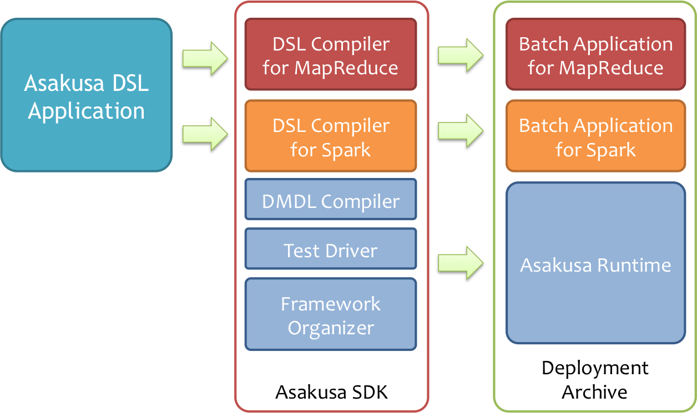
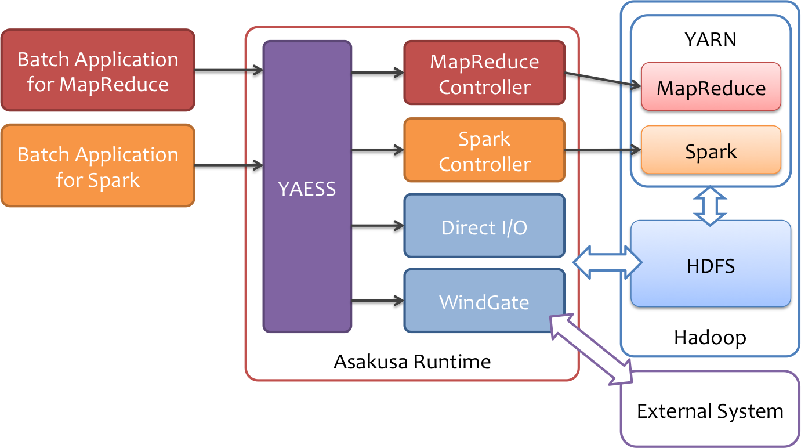

=============================
Asakusa on Spark ユーザガイド
=============================

この文書では、 `Asakusa Framework`_ を使って作成したバッチアプリケーションを `Apache Spark`_ 上で実行する方法について説明します。

..  warning::
    現時点では、この文書で説明する Asakusa on Spark の機能は **Developer Preview** として公開しています。
    
    * プロダクション環境での利用は現時点では非推奨です。
    * 本機能は今後、予告なしに仕様を変更する可能性があります。
    * 本機能は今後、予告なしに対応プラットフォームを変更する可能性があります。

..  _`Asakusa Framework`: http://docs.asakusafw.com/latest/release/ja/html/index.html
..  _`Apache Spark`: http://spark.apache.org/

概要
====

Asakusa on Sparkは、Asakusa DSLを始めとするAsakusa Frameworkの開発基盤を利用して作成したバッチアプリケーションに対して、Sparkをその実行基盤として利用するための機能セットを提供します。

Sparkは高速で汎用性の高い、スケーラブルなデータ処理基盤を提供する目的で作成されたオープンソースソフトウェアです。いくつかの適用用途においてHadoop MapReduceよりも高速に動作する事例が公開されており、現在急速にその利用が拡大しています。

Asakusa Frameworkの適用領域においても、いくつかのケースでSparkを利用することで従来より高速にバッチアプリケーションが動作することを確認しています。Asakusa on Sparkによって、Asakusa Frameworkがより高速で汎用的なバッチアプリケーションの開発/実行基盤として利用できるようになることを目指しています。

構成
====

Asakusa on Sparkを利用する場合、従来のAsakusa Frameworkが提供するDSLやテスト機構をそのまま利用して開発を行います。
アプリケーションをビルドして運用環境向けの実行モジュール（デプロイメントアーカイブ）を作成する段階ではじめてSpark用のコンパイラを利用します。

また、Asakusa DSL Compiler for Sparkで生成したバッチアプリケーションは、従来と同様にYAESSを利用して実行できます。

Asakusa DSL
  従来のAsakusa DSLやDMDLで記述したバッチアプリケーションは基本的に変更なしで、Asakusa DSL Compiler for Sparkを利用してSpark向けの実行モジュールを生成することができます。

テスト機構
  従来のAsakusa DSLのテスト方法と同様に、エミュレーションモードを利用してAsakusa DSLのテストを実行することができます。このとき、Sparkは特に利用しません。

アプリケーションの実行
  従来と同様、YAESSを利用してバッチアプリケーションを実行することができます。
  実行環境にMapReduce用のバッチアプリケーションとSpark用のバッチアプリケーションを両方配置して運用することも可能です。

外部システム連携
  Direct I/OやWindGateといった外部システム連携モジュールはSpark向けのバッチアプリケーションでもそのまま利用することができます。
  Direct I/OやWindGateの実行にはHadoopの機能を使用します。Direct I/Oの入出力処理にはMapReduceが使用されるため、MapReduceが動作する環境が併せて必要になります。

..  attention::
    Asakusa on Sparkを利用する上でも外部システム連携機能などにおいて、一部Hadoop MapReduceの機能を利用します。

..  hint::
    Asakusa on Sparkを利用する場合Hadoopクラスタ上でMapReduceとSparkのリソースをまとめて管理できるYARNの利用を推奨しています。

..  _target-platform:

対応プラットフォーム
====================

Hadoopディストリビューション
----------------------------

Asakusa on Sparkは、以下のHadoopディストリビューションと組み合わせた運用環境で動作を検証しています。

..  list-table:: 動作検証プラットフォーム(Hadoopディストリビューション)
    :widths: 3 3 3 2
    :header-rows: 1

    * - Distribution
      - Version
      - OS
      - JDK
    * - Hortonworks Data Platform
      - 2.3 (Apache Hadoop 2.7.1)
      - CentOS 7 (7.1)
      - JDK 8 (1.8.0_51)
    * - MapR
      - 5.0.0 (MRv2)
      - CentOS 6 (6.6)
      - JDK 7 (1.7.0_75)
    * - Amazon EMR
      - AMI 4.1.0
      - Amazon Linux 2015.03
      - JDK 7 (1.7.0_85)

Spark
-----

Asakusa on Sparkは、Spark 1.6.0 で動作を検証しています。

また、Sparkの動作モードとして、YARN cluster mode、および YARN client modeで動作を確認しています。

..  attention::
    その他のバージョンを利用して問題が発生した場合は、上記のバージョンを利用してください。

..  seealso::
    SparkのYARN上での動作モードについては、Sparkのドキュメント `Running Spark on YARN`_ を参照してください。

..  _`Running Spark on YARN`: https://spark.apache.org/docs/latest/running-on-yarn.html

Asakusa Framework 対応バージョンとコンポーネント
------------------------------------------------

Asakusa on Sparkは、Asakusa Framework 0.8.0 以降のバージョンが必要です。

..  warning::
    上記のバージョンより古いバージョンを使用している場合、以降の手順を実施する **前に** 、 :asakusafw:`Asakusa Gradle Plugin マイグレーションガイド <application/gradle-plugin.html#vup-gradle-plugin>` を参考にして上記のバージョンにマイグレーションしてください。

また運用環境で利用するAsakusa Frameworkバージョンは、Hadoop2系向けAsakusa Framework ( ``-hadoop2`` )でのみ動作を検証しています。

アプリケーションのビルドで使用するGradleのバージョンは ``2.8`` に対応しています。これより古いGradleのバージョンを使用している場合、以降の手順を実施する **前に** 、 :asakusafw:`プロジェクトで利用するGradleのバージョンアップ <application/gradle-plugin.html#vup-gradle-wrapper>` を参考にしてバージョンをあげてください。

..  attention::
    Eclipse上で `Shafu`_ を利用している場合、Eclipse設定画面のメニューから :guilabel:`Jinrikisha (人力車)` 選択し、 :guilabel:`Gradleのバージョン` を上記のバージョンに設定してください。

..  _`Shafu`: http://docs.asakusafw.com/jinrikisha/ja/html/shafu.html

..  seealso::
    Asakusa Frameworkバージョンについては、 :asakusafw:`Asakusa Framework デプロイメントガイド <administration/deployment-guide.html>` などを参照してください。

非対応機能
~~~~~~~~~~

Asakusa on Sparkは、Asakusa Frameworkが提供する以下の機能には対応していません。

* ThunderGate
* レガシーモジュール
* その他該当バージョンで非推奨となっている機能

リンク
------

各対応プラットフォームへのリンクです。

..  list-table::
    :widths: 3 7
    :header-rows: 1

    * - Product
      - Link
    * - Apache Spark
      - http://spark.apache.org/
    * - Hortonworks Data Platform
      - http://hortonworks.com/hdp/
    * - MapR
      - http://www.mapr.com/
    * - Amazon EMR
      - http://aws.amazon.com/elasticmapreduce/
    * - JDK (Java SE)
      - http://www.oracle.com/technetwork/java/javase/index.html
    * - Gradle
      - http://www.gradle.org/

開発環境の構築
==============

開発環境は従来のAsakusa Frameworkの開発環境をそのまま利用することができます。

新規に開発環境を構築する場合は、以下のドキュメントなどを参考にして開発環境を準備してください。

* :asakusafw:`Asakusa Framework スタートガイド <introduction/start-guide.html>`
* :asakusafw:`Asakusa Framework スタートガイド for Windows <introduction/start-guide-windows.html>`
* :jinrikisha:`Jinrikisha - Asakusa Framework Starter Package - <index.html>`

..  attention::
    Asakusa on Sparkを利用する場合、開発環境で使用するJavaはJDK7が必要です。JDK6には対応していません。

アプリケーションの開発
======================

開発環境上で Asakusa Frameworkのバッチアプリケーションを開発し、Spark向けのアプリケーションをビルドする方法を見ていきます。

ここでは、 :asakusafw:`Asakusa Framework スタートガイド <introduction/start-guide.html>` などで使用しているサンプルアプリケーション「カテゴリー別売上金額集計バッチ」をSpark向けにビルドするよう設定します。

Asakusa on Spark Gradle Plugin
------------------------------

Asakusa on Spark Gradle Pluginは、アプリケーションプロジェクトに対してAsakusa on Sparkのさまざまな機能を追加します。

Asakusa on Spark Gradle Pluginを有効にするには、アプリケーションプロジェクトのビルドスクリプト ( :file:`build.gradle` )に対して以下の設定を追加します。

* ``buildscript/dependencis`` ブロックに指定しているAsakusa Gradle Pluginの指定をAsakusa on Spark Gradle Pluginの指定に置き換える。

  * ``group: 'com.asakusafw.spark', name: 'asakusa-spark-gradle', version: '0.3.0'``

* Asakusa on Spark Gradle Pluginを適用する定義を追加する
  
  * ``apply plugin: 'asakusafw-spark'``

以下はAsakusa on Spark Gradle Pluginの設定を追加したビルドスクリプトの例です。

:download:`build.gradle <attachment/build.gradle>`

..  literalinclude:: attachment/build.gradle
    :language: groovy
    :lines: 1-20
    :emphasize-lines: 6,18

アプリケーションのビルド
------------------------
`Asakusa on Spark Gradle Plugin`_ を設定した状態で、Gradleタスク :program:`sparkCompileBatchapps` を実行すると、Asakusa DSL Compiler for Sparkを利用し、Spark向けのバッチアプリケーションのビルドを実行します。

..  code-block:: sh
    
    ./gradlew sparkCompileBatchapps

:program:`sparkCompileBatchapps` タスクを実行すると、アプリケーションプロジェクトの :file:`build/spark-batchapps` 配下にビルド済みのバッチアプリケーションが生成されます。

標準の設定では、Asakusa DSL Compiler for Sparkよって生成したバッチアプリケーションは接頭辞に ``spark.`` が付与されます。
例えば、サンプルアプリケーションのバッチID ``example.summarizeSales`` の場合、Spark向けのバッチアプリケーションのバッチIDは ``spark.example.summarizeSales`` となります。

..  seealso::
    Asakusa DSL Compiler for Sparkで利用可能な設定の詳細は、 :doc:`reference` を参照してください。

デプロイメントアーカイブの生成
------------------------------

`Asakusa on Spark Gradle Plugin`_ を設定した状態で、Asakusa Frameworkのデプロイメントアーカイブを作成すると、Hadoop MapReduce用とSpark用のバッチアプリケーションアーカイブを含むデプロイメントアーカイブを生成します。

デプロイメントアーカイブを生成するには Gradleの :program:`assemble` タスクを実行します。

..  code-block:: sh
    
    ./gradlew assemble

..  hint::
    Shafu利用する場合は、プロジェクトを選択してコンテキストメニューから :menuselection:`Jinrikisha (人力車) --> Asakusaデプロイメントアーカイブを生成` を選択します。

アプリケーションの実行
======================

ここでは、Asakusa on Spark固有の実行環境の設定について説明します。

Asakusa Frameworkの実行環境の構築方法やバッチアプリケーションを実行する方法の基本的な流れは、 :asakusafw:`Asakusa Framework デプロイメントガイド <administration/deployment-guide.html>` などを参照してください。

Sparkのセットアップ
-------------------

以降の説明で実施する手順は、Sparkがセットアップ済みのHadoopクラスターを対象とします。SparkのセットアップについてはSparkのドキュメントや利用するHadoopディストリビューションのドキュメント等を参考にして下さい。

spark-submitの検索方法
----------------------

Sparkを起動する際には、起動する対象の :program:`spark-submit` コマンドの配置場所を環境変数に指定する必要があります。
Spark向けのバッチアプリケーションを実行する際には、次の手順で :program:`spark-submit` コマンドを検索します。

* 環境変数 ``SPARK_CMD`` が設定されている場合、 ``$SPARK_CMD`` を :program:`spark-submit` コマンドとみなして利用します。
* :program:`spark-submit` コマンドのパス ( 環境変数 ``PATH`` ) が通っている場合、それを利用します。

上記の手順で :program:`spark-submit` コマンドが見つからない場合、対象処理の実行に失敗します。

Asakusa on Sparkの実行に環境変数を利用する場合、 :file:`$ASAKUSA_HOME/spark/conf/env.sh` 内でエクスポートして定義できます。

..  code-block:: sh
    
    export SPARK_CMD=/opt/spark/bin/spark-submit

..  tip::
    バッチアプリケーション実行時の環境変数は、YAESSプロファイルで設定することも可能です。
    
    Asakusa on Sparkを利用する場合、コマンドラインジョブのプロファイル ``command.spark`` が利用できます。 :file:`$ASAKUSA_HOME/yaess/conf/yaess.properties` に ``command.spark.env.SPARK_CMD`` といったような設定を追加することで、YAESSからSparkを実行する際に環境変数が設定されます。
    
    YAESSのコマンドラインジョブの設定方法について詳しくは、 :asakusafw:`YAESSユーザーガイド - コマンドラインジョブの実行 <yaess/user-guide.html#yaess-profile-command-section>` などを参照してください。

バッチアプリケーションの実行
----------------------------

デプロイしたバッチアプリケーションをYAESSを使って実行します。

:program:`$ASAKUSA_HOME/yaess/bin/yaess-batch.sh` コマンドに実行するバッチIDとバッチ引数を指定してバッチを実行します。
標準の設定では、Spark向けのバッチアプリケーションはバッチIDの接頭辞に ``spark.`` が付与されているので、このバッチIDを指定します。

..  attention::
    標準の設定では、バッチIDの接頭辞に ``spark.`` がついていないバッチIDは従来のHadoop MapReduce向けバッチアプリケーションです。YAESSの実行時にバッチIDの指定を間違えないよう注意してください。

例えば、サンプルアプリケーションを実行する場合は、以下のように :program:`yaess-batch.sh` を実行します。

..  code-block:: sh

    $ASAKUSA_HOME/yaess/bin/yaess-batch.sh spark.example.summarizeSales -A date=2011-04-01

..  seealso::
    サンプルアプリケーションのデプロイやデータの配置、実行結果の確認方法などは、 :asakusafw:`Asakusa Framework スタートガイド - サンプルアプリケーションの実行 <introduction/start-guide.html#startguide-running-example>` を参照してください。

バッチアプリケーション実行時の設定
~~~~~~~~~~~~~~~~~~~~~~~~~~~~~~~~~~~

:file:`$ASAKUSA_HOME/spark/conf/spark.properties` にはバッチアプリケーション実行時の設定を定義します。実行環境に応じて以下の値を設定してください｡

``com.asakusafw.spark.parallelism``
    バッチアプリケーション実行時に、ステージごとの標準的なタスク分割数を指定します。

    ステージの特性（推定データサイズや処理内容）によって、この分割数を元に実際のタスク分割数が決定されます。

    標準的には、SparkのExecutorに割り当てた全コア数の1〜4倍程度を指定します。
    
    このプロパティが設定されていない場合、 ``spark.default.parallelism`` の値を代わりに利用します。いずれのプロパティも設定されていない場合、下記の既定値を利用します。

    既定値: ``2``

..  seealso::
    その他のバッチアプリケーション実行時の設定については、 :doc:`optimization` を参照してください。

